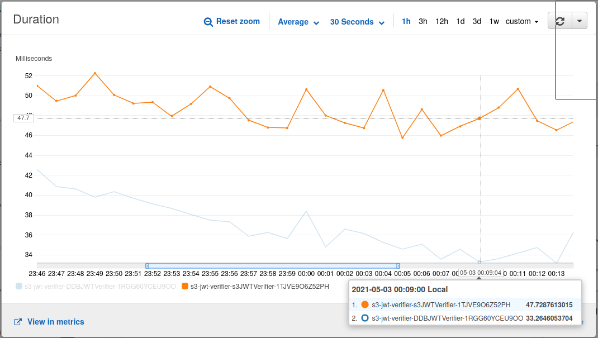

# Loading public keys from S3 or DynamoDB - which is faster

TL;DR: Loading the same string object stored in an S3 object is roughly 40% slower than loading the same string from a DynamoDB table.

If I've made some gross mistakes or missed some cool optimization, please make a pull request and I'll rerun.

## Requirements:
* NodeJS 14.0 or later for running scripts
* AWS SAM for deployment
* AWS CLI credentials configured with a user allowed to create IAM users (SAM needs to create a role for the Lambda function) and write to DynamoDB and S3

## Running

Here's the flow to perform a benchmark:

* Most likely your computer is very fast and can easily and quickly generate public and private keys in the thousands. Run `1_make_keys.sh [NBR_OF_KEYS]` to generate the number of keys you desire.
* To simplify benchmarking, generate a JSON file with signed JWTs using `2_sign.js`. It will create a JSON-file named `tokens.json` containing pre-signed JWT.
* Load DynamoDB table with `3_ddbloader.js [TABLE_NAME] [AWS_REGION]`. Example usage: `node ddbLoader myTable eu-west-1`
* Sync `public_keys/` directory to S3 using AWS CLI, e.g. `aws s3 sync public_keys/ s3://my-bucket`
* Deploy `sam/s3-vs-ddb/` using AWS SAM, e.g. `cd sam/s3-vs-ddb/ && sam deploy --guided`. Note the names of the two functions deployed from SAM.
* Generate load to benchmark using `5_loadtester [function-name]` as provided by SAM

## Discussion

It's not a huge shocker that DynamoDB is more suitable for storing and retrieving simple strings than S3. Our simplistic case of just using S3 as a lookup table make the conditions for S3 as favorable as possible (if there was a bigger file needing to be parsed to find a specific key load times for the bigger file would be much worse compared to DynamoDB). So, if the execution difference is in the 10-15ms range you'd be tempted to thing it doesn't matter in the long run. But since AWS [changed the billing for Lambda to millisecond billing](https://aws.amazon.com/blogs/aws/new-for-aws-lambda-1ms-billing-granularity-adds-cost-savings/), the implication is that S3 would be roughly 40% more expensive than using DynamoDB. For millions of invocatiotions a a day, that will have huge pricing implications.

## Example measurement

